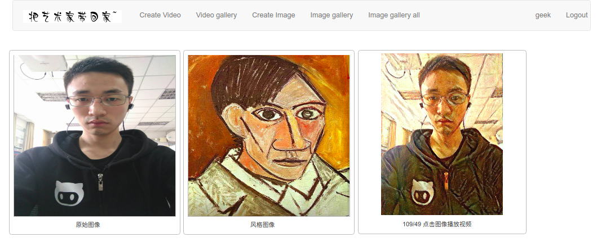
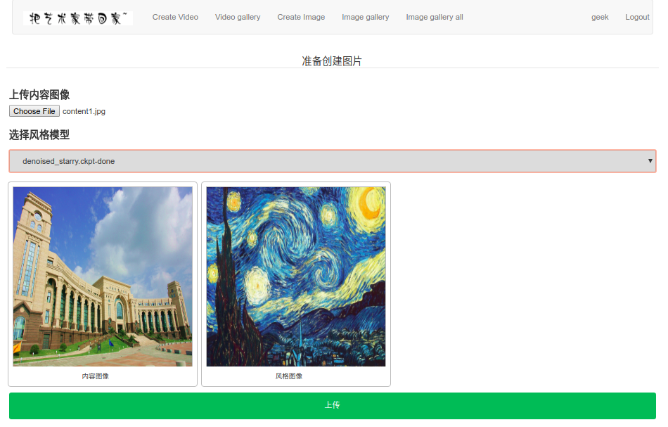
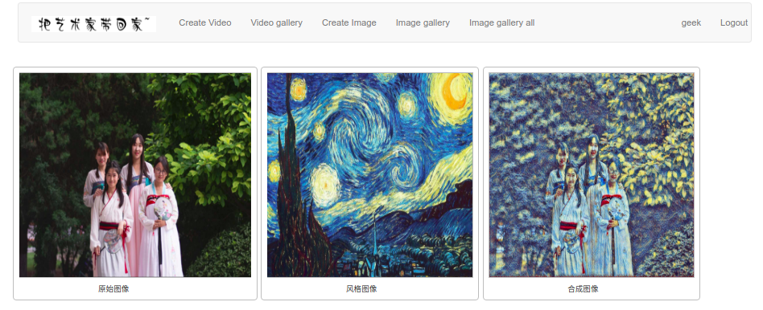

## 这是什么?
一个能够融合内容和风格的web应用．学名叫`把艺术家带回家`
该分支为gpu模式
## 需要环境
* tmuxinator
* nvidia-docker
## 需要文件
需要的数据和模型建议按照如下方式存放
```
/Dataset
	style_transfer---存放展示的图片集(可选)
/Model
	styles--风格模型(必须)
	vgg16
		vgg16.ckpt----用于训练风格模型(可选)
	vgg19----必须
		VGG_ILSVRC_19_layers.caffemodel
		VGG_ILSVRC_19_layers_deploy.prototxt
		vgg_normalised.caffemodel
```

项目本身预置的软连接关系如下:

```
$Proj/fast-neural-style-tensorflow/models --> /Model/styles
$Proj/fast-neural-style-tensorflow/train2014 --> /Dataset/train2014
$Proj/neural-style/model--> /Model/vgg19
$Proj/media/img_list_all --> /Dataset/style_transfer
```

## 如何使用
#### 克隆工程
```
git clone --recurse-submodules -b accelerate git@github.com:lihao2333/neural_web.git
cd neural_web
```
#### 制作镜像　
```
docker build -t lihao2333/superintel:1.0 .
```
这里`lihao2333/superintel:1.0`可以任意起，但是如果你修改的话，请在`neural_web.yml`中进行对应的替换
#### 配置tmuxinator
ubuntu16.04:
```
ln -sf `pwd`/neural_web.yml ~/.tmuxinator/
```
mac:
```
ln -sf `pwd`/neural_web.yml ~/.config/tmuxinator
```

#### 运行
```
mux start neural_web
```
#### 创建用户
在开启的tmux中，进入window1的右边的pane,执行`python3 manage.py createsuperuser`创建用户

#### 测试
浏览器输入`localhost:8000`,用刚才的用户登录

## 最终效果
* 查看视频

* 创建图片

* 查看图片

* 查看精选图片

